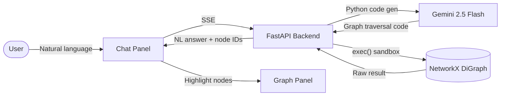
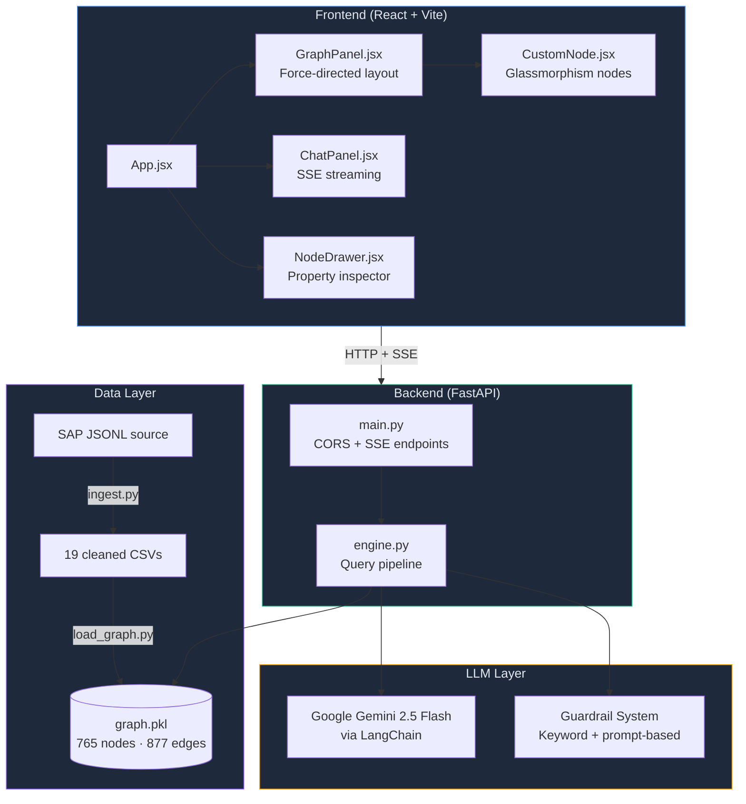
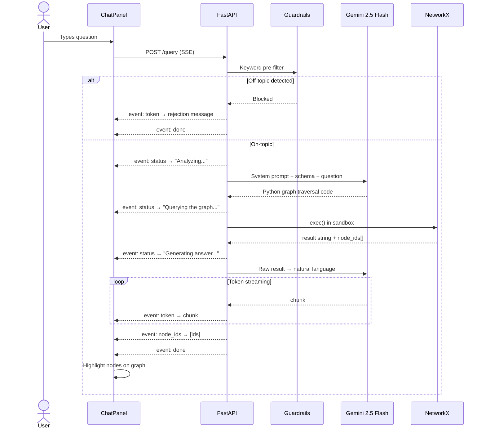
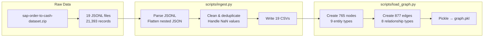
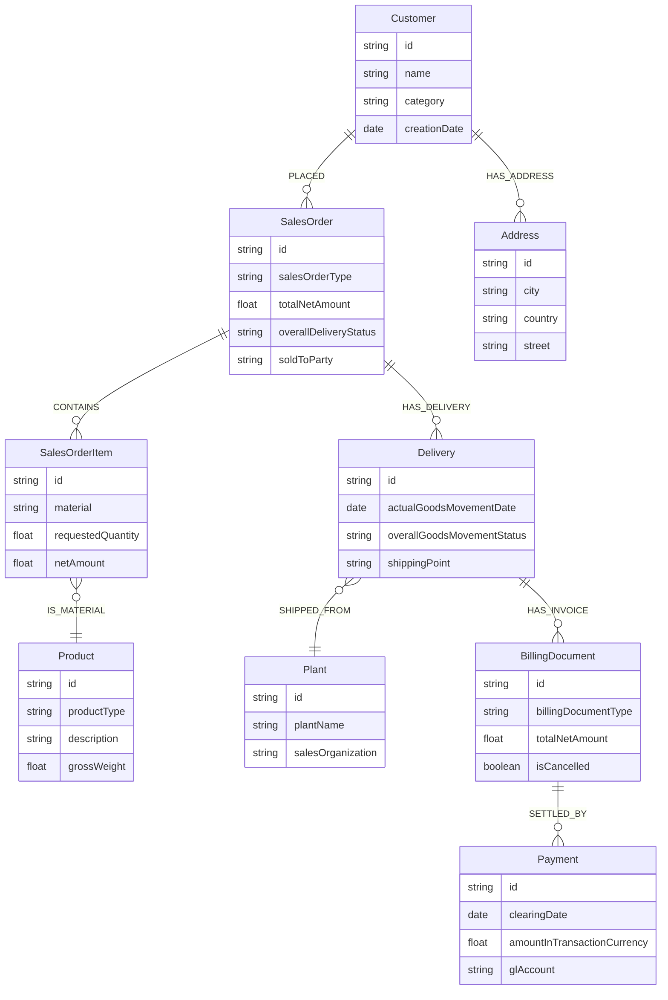
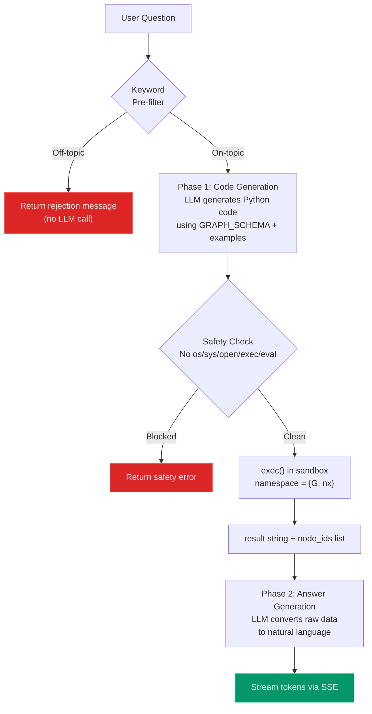
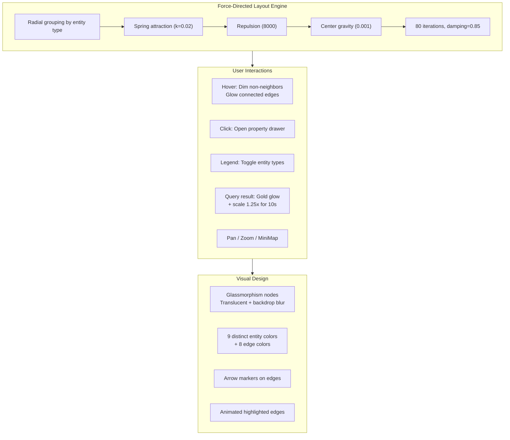
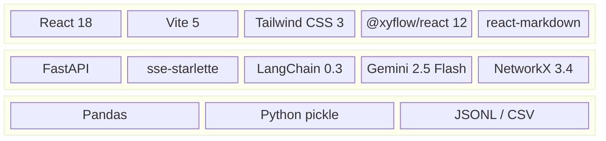
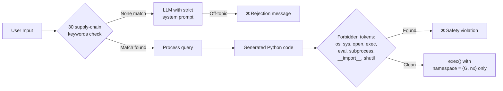

# Graph Data Explorer AI

> An interactive graph-based data modeling and natural language query system built on SAP Order-to-Cash data.  
> Ask questions in plain English — the AI writes graph queries, executes them, and streams back answers with visual highlights.

---

## Table of Contents

- [Overview](#overview)
- [System Architecture](#system-architecture)
- [Request Lifecycle](#request-lifecycle)
- [Data Pipeline](#data-pipeline)
- [Graph Schema](#graph-schema)
- [LLM Query Engine](#llm-query-engine)
- [Frontend Visualization](#frontend-visualization)
- [Project Structure](#project-structure)
- [Tech Stack](#tech-stack)
- [Getting Started](#getting-started)
- [API Reference](#api-reference)
- [Guardrails & Safety](#guardrails--safety)

---

## Overview

This project transforms flat SAP Order-to-Cash transactional data (19 JSONL tables, 21,393 records) into a **knowledge graph** (765 nodes, 877 edges) and exposes it through:

1. **A natural language query engine** — powered by Google Gemini 2.5 Flash — that converts English questions into Python graph traversals
2. **An interactive graph visualization** — React Flow with force-directed layout, color-coded entity types, hover effects, and query-result highlighting
3. **A streaming chat interface** — SSE-based real-time token delivery with Markdown rendering



---

## System Architecture



---

## Request Lifecycle



---

## Data Pipeline



### Source Tables (19 JSONL → CSV)

| Category | Tables                                                                                                               |
| -------- | -------------------------------------------------------------------------------------------------------------------- |
| Sales    | `sales_order_headers`, `sales_order_items`, `sales_order_schedule_lines`                                             |
| Delivery | `outbound_delivery_headers`, `outbound_delivery_items`                                                               |
| Billing  | `billing_document_headers`, `billing_document_items`, `billing_document_cancellations`                               |
| Payment  | `payments_accounts_receivable`, `journal_entry_items_accounts_receivable`                                            |
| Master   | `business_partners`, `business_partner_addresses`, `customer_company_assignments`, `customer_sales_area_assignments` |
| Product  | `products`, `product_descriptions`, `product_plants`, `product_storage_locations`                                    |
| Org      | `plants`                                                                                                             |

---

## Graph Schema



### Node Counts

| Entity          |   Count | Example ID                 |
| --------------- | ------: | -------------------------- |
| Customer        |       8 | `Customer:320000082`       |
| SalesOrder      |     100 | `SalesOrder:740532`        |
| SalesOrderItem  |     167 | `SalesOrderItem:740532-10` |
| Delivery        |      86 | `Delivery:80016100`        |
| BillingDocument |     163 | `BillingDocument:90504298` |
| Payment         |     120 | `Payment:1400000051`       |
| Product         |      69 | `Product:TG11`             |
| Plant           |      44 | `Plant:1010`               |
| Address         |       8 | `Address:320000082-1`      |
| **Total**       | **765** |                            |

### Edge Types (877 total)

| Relationship                | Direction      | Edge Type                |
| --------------------------- | -------------- | ------------------------ |
| Customer → SalesOrder       | `PLACED`       | Customer placed an order |
| SalesOrder → SalesOrderItem | `CONTAINS`     | Order line items         |
| SalesOrderItem → Product    | `IS_MATERIAL`  | Material reference       |
| SalesOrder → Delivery       | `HAS_DELIVERY` | Fulfillment link         |
| Delivery → Plant            | `SHIPPED_FROM` | Shipping origin          |
| Delivery → BillingDocument  | `HAS_INVOICE`  | Invoice generation       |
| BillingDocument → Payment   | `SETTLED_BY`   | Payment settlement       |
| Customer → Address          | `HAS_ADDRESS`  | Customer address         |

---

## LLM Query Engine

The engine uses a **two-phase LLM pipeline** to convert natural language into graph answers:



### Key Design Decisions

| Decision                                      | Rationale                                                                                             |
| --------------------------------------------- | ----------------------------------------------------------------------------------------------------- |
| **Keyword pre-filter before LLM**             | Saves API calls + latency for obviously off-topic questions like "write me a poem"                    |
| **Working code examples in schema**           | Dramatically improved code generation quality — LLM copies patterns instead of guessing API           |
| **Sandboxed exec()**                          | Forbidden list blocks `os`, `sys`, `open`, `subprocess`, `__import__`, `eval`, `exec`                 |
| **Two-phase pipeline**                        | Phase 1 (code gen) + Phase 2 (NL answer) — separating concerns improves both accuracy and readability |
| **Conversation history (deque, 10 messages)** | Enables follow-up questions without losing context                                                    |

---

## Frontend Visualization



### Component Responsibilities

| Component        | Lines | Role                                                                                         |
| ---------------- | ----: | -------------------------------------------------------------------------------------------- |
| `GraphPanel.jsx` |  ~300 | Force layout algorithm, React Flow orchestration, legend with filters, hover/highlight logic |
| `CustomNode.jsx` |   ~70 | Glassmorphism rendering, glow effects, dim/blur states, type badge + name + ID display       |
| `ChatPanel.jsx`  |  ~230 | SSE stream reader, Markdown rendering, example queries, message history                      |
| `NodeDrawer.jsx` |   ~35 | Slide-out property inspector for clicked nodes                                               |
| `App.jsx`        |   ~75 | Layout shell, graph data fetch, highlight state management                                   |

---

## Project Structure

```
Graph-Data-Explorer-AI/
├── backend/
│   ├── engine.py              # LLM query engine (two-phase pipeline)
│   └── main.py                # FastAPI app (SSE + REST endpoints)
├── frontend/
│   ├── src/
│   │   ├── App.jsx            # Root component + state management
│   │   ├── index.css          # Tailwind + custom animations
│   │   └── components/
│   │       ├── GraphPanel.jsx # Force layout + React Flow
│   │       ├── CustomNode.jsx # Glassmorphism node renderer
│   │       ├── ChatPanel.jsx  # SSE chat with Markdown
│   │       └── NodeDrawer.jsx # Node property drawer
│   ├── index.html
│   ├── tailwind.config.js
│   └── vite.config.js
├── scripts/
│   ├── ingest.py              # JSONL → cleaned CSV (19 tables)
│   ├── load_graph.py          # CSV → NetworkX graph → graph.pkl
│   ├── test_engine.py         # 4 end-to-end query tests
│   └── verify_connectivity.py # Graph connectivity checks
├── data/
│   ├── sap-o2c-data/          # Raw JSONL source files
│   ├── cleaned/               # 19 processed CSVs
│   └── graph.pkl              # Serialized NetworkX DiGraph
├── .env                       # GEMINI_API_KEY
├── .gitignore
├── docker-compose.yml         # Optional Neo4j setup
├── start.sh                   # One-command launcher
└── README.md
```

---

## Tech Stack



| Layer        | Technologies                                                           |
| ------------ | ---------------------------------------------------------------------- |
| **Frontend** | React 18, Vite 5, Tailwind CSS 3, @xyflow/react 12, react-markdown     |
| **Backend**  | FastAPI, Uvicorn, sse-starlette, python-dotenv                         |
| **LLM**      | Google Gemini 2.5 Flash, LangChain 0.3.7, langchain-google-genai 2.0.4 |
| **Graph**    | NetworkX 3.4.2, pickle serialization                                   |
| **Data**     | Pandas, JSONL/CSV processing                                           |

---

## Getting Started

### Prerequisites

- **Python 3.10+** with `venv`
- **Node.js 18+** with `npm`
- **Google Gemini API Key** — [Get one here](https://aistudio.google.com/apikey)

### Quick Start

```bash
# 1. Clone the repository
git clone <repo-url>
cd Graph-Data-Explorer-AI

# 2. Set up environment
python3 -m venv venv
source venv/bin/activate
pip install fastapi uvicorn sse-starlette python-dotenv \
            networkx pandas langchain langchain-google-genai

# 3. Configure API key
echo 'GEMINI_API_KEY=your-key-here' > .env

# 4. Ingest data & build graph
python scripts/ingest.py       # JSONL → 19 CSVs
python scripts/load_graph.py   # CSVs → graph.pkl (765 nodes, 877 edges)

# 5. Start backend
cd backend && uvicorn main:app --port 8002 &

# 6. Start frontend
cd ../frontend && npm install && npm run dev
```

Or use the convenience script:

```bash
chmod +x start.sh && ./start.sh
```

Open **http://localhost:5173** — the graph loads automatically. Type a question in the chat panel.

### Example Queries

| Query                                            | What it does                                                     |
| ------------------------------------------------ | ---------------------------------------------------------------- |
| "How many sales orders does each customer have?" | Counts orders per customer with node IDs                         |
| "Trace the full journey of Sales Order 740532"   | Follows O2C path: order → items → delivery → invoices → payments |
| "Which billing documents are cancelled?"         | Filters by `isCancelled` property                                |
| "Show deliveries with incomplete goods movement" | Checks `overallGoodsMovementStatus` field                        |

---

## API Reference

### `GET /health`

Returns backend status and graph statistics.

```json
{
  "status": "healthy",
  "engine": "networkx",
  "graph": { "nodes": 765, "edges": 877 }
}
```

### `GET /graph`

Returns the full graph as JSON for visualization.

```json
{
  "nodes": [
    { "node_id": "Customer:320000082", "label": "Customer", "name": "..." }
  ],
  "edges": [
    {
      "source": "Customer:320000082",
      "target": "SalesOrder:740532",
      "type": "PLACED"
    }
  ]
}
```

### `POST /query` (SSE Streaming)

**Body:** `{"question": "How many customers are there?"}`

**SSE Events:**
| Event | Payload | Description |
|-------|---------|-------------|
| `status` | `{"content": "Analyzing..."}` | Progress indicator |
| `token` | `{"content": "There"}` | Streamed answer token |
| `node_ids` | `{"node_ids": ["Customer:320000082"]}` | Referenced graph nodes |
| `done` | `{"content": ""}` | Stream complete |
| `error` | `{"error": "..."}` | Error occurred |

### `POST /query/sync`

Non-streaming version for testing. Same body, returns full JSON response.

### `GET /graph/schema`

Returns the graph schema description used by the LLM.

---

## Guardrails & Safety



**Three layers of protection:**

1. **Keyword pre-filter** — 30 supply-chain keywords (`order`, `deliver`, `invoice`, `payment`, `customer`, `product`, etc.). If none match, the question is likely off-topic → sent to LLM with strict system prompt that only allows the rejection message.

2. **Code safety scan** — Before execution, generated code is checked for forbidden patterns: `import os`, `import sys`, `open(`, `exec(`, `eval(`, `subprocess`, `__import__`, `shutil`, `pathlib`.

3. **Sandboxed execution** — Code runs in a restricted namespace containing only `G` (the graph) and `nx` (NetworkX). No access to file system, network, or dangerous builtins.

---

### Development Phases

```mermaid
gantt
    title Development Phases
    dateFormat X
    axisFormat %s

    section Phase 1
    Environment & Data Ingestion     :done, p1, 0, 1

    section Phase 2
    Graph Construction (765 nodes)   :done, p2, 1, 2

    section Phase 3
    Backend API + LLM Engine         :done, p3, 2, 3

    section Phase 4
    Frontend (React Flow + Chat)     :done, p4, 3, 4

    section Phase 5
    Documentation & Polish           :done, p5, 4, 5

    section Post-Launch
    Bug Fixes & Visual Overhaul      :done, p6, 5, 6
```



### Key Prompts & Workflows

| Phase                  | Prompt / Task                                                                | AI Contribution                                                             |
| ---------------------- | ---------------------------------------------------------------------------- | --------------------------------------------------------------------------- |
| **Data Ingestion**     | "Parse 19 JSONL tables, flatten nested JSON, clean NaN values, deduplicate"  | Complete `ingest.py` script — handles all 19 table schemas                  |
| **Graph Construction** | "Build NetworkX DiGraph from CSVs with typed nodes and directed edges"       | Node/edge creation with 8 relationship types, ID formatting (`Label:value`) |
| **Query Engine**       | "Two-phase LLM pipeline: NL → Python code → exec → NL answer"                | Full `engine.py` with guardrails, sandboxing, conversation history          |
| **Schema Enhancement** | "Add working Python code examples to GRAPH_SCHEMA"                           | Key breakthrough — LLM code-gen accuracy jumped dramatically                |
| **Frontend**           | "React Flow graph with force-directed layout, SSE streaming chat"            | All 5 components, force layout algorithm, SSE parser                        |
| **Visual Overhaul**    | "Glassmorphism nodes, hover dimming, color-coded edges, animated highlights" | Complete rewrite of `GraphPanel.jsx` and `CustomNode.jsx`                   |

### Lessons Learned

1. **Schema examples > schema descriptions** — Adding working Python code examples to the LLM's graph schema prompt was the single most impactful improvement. The LLM went from broken traversals to correct queries immediately.

2. **Port management matters** — In long development sessions, zombie processes and stale servers cause confusing failures. Always verify which process actually owns a port before debugging application code.

3. **Two-phase LLM is cleaner than one** — Separating "write code to query the graph" from "explain the results in English" produces better output for both tasks. The code-gen prompt can be technical; the answer prompt can focus on readability.

4. **Force layout needs tuning per dataset** — Repulsion = 8000, spring k = 0.02, 80 iterations worked well for ~765 nodes. Smaller graphs need less repulsion; larger graphs need more iterations and adaptive cooling.

5. **Keyword pre-filter saves cost** — A simple keyword check before LLM invocation prevents unnecessary API calls for obviously off-topic questions, reducing both latency and cost.
